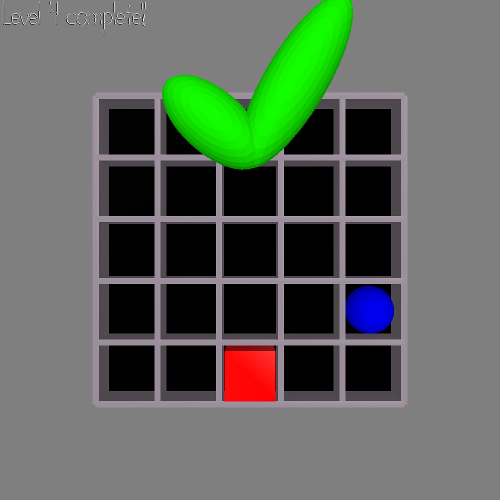

# The Pentaton

#### Author: Dominic Calkosz

## Design:

This game introduces an instrument called the Pentaton, which uses blocks of different shapes and colors to play notes on a grid.
Explore how it works in freeplay mode, or jump into a sequence of 7 levels.
For a customized experience, replace the audio files provided with your own sound font.

## Screen Shot:

## How To Play:

* _WASD_ to shift
* _Q/E_ to rotate
* _Space_ (hold) to listen to the goal
* _enter_ to toggle freeplay
* _?_ to show/hide controls
* _escape_ to free the mouse
* _backspace_ to quit

### Freeplay controls:

* _Space_ to create/destroy at the origin
* _Arrow keys_ to cycle the origin shape/color

## Sources:

All models haphazardly created by me in Blender.
Additional audio provided by [FreePats](http://freepats.zenvoid.org/). Full credits and license are available in the "readme.txt" file in each instrument directory.
Special thank you to Alyssa Lee for her [drawable duplication code](https://github.com/lassyla/game2/blob/master/FishMode.cpp?fbclid=IwAR2gXxc_Omje47Xa7JmJPRN6Nh2jGSEnMVn1Qw7uoSV0QwKu0ZwwAUu5528).

This game was built with [NEST](NEST.md).

